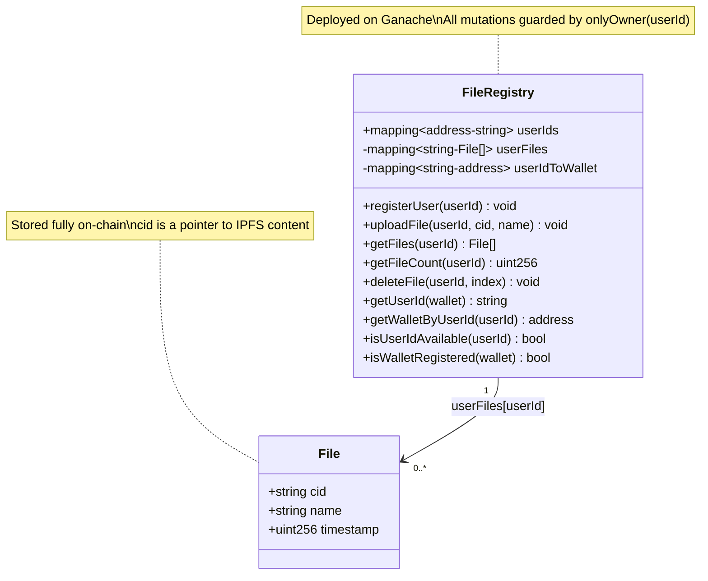
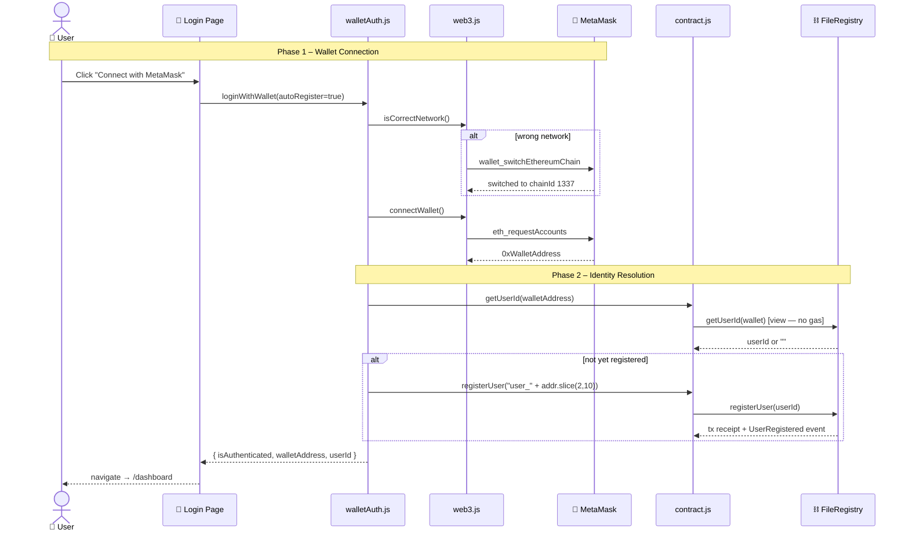
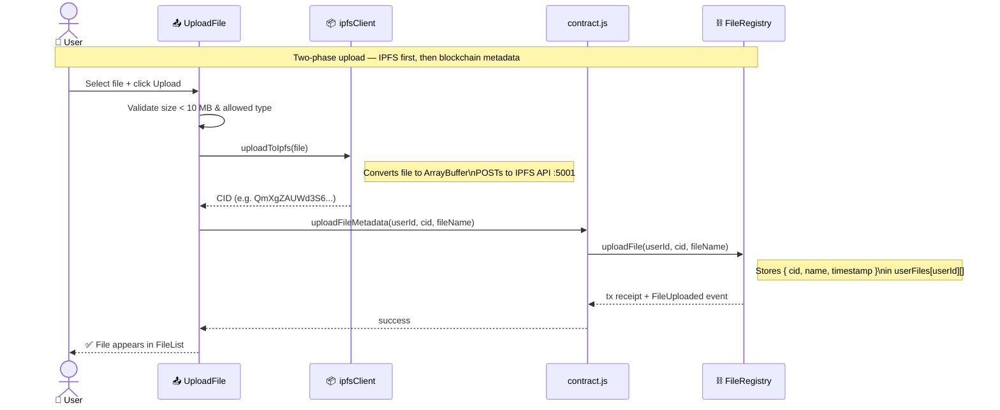
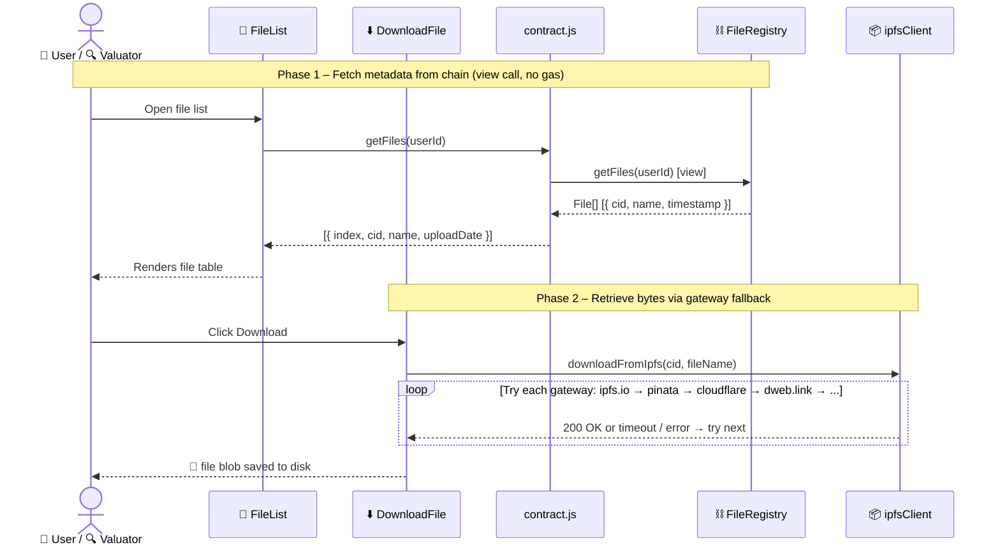
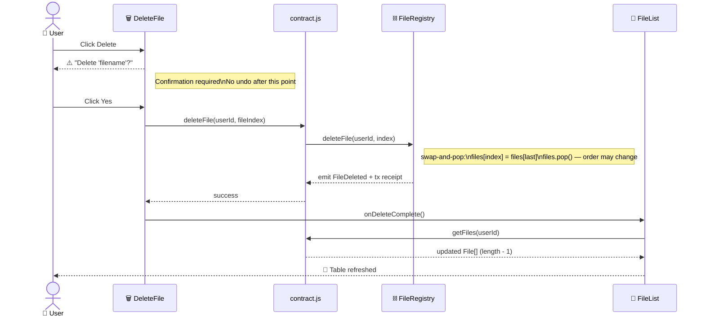
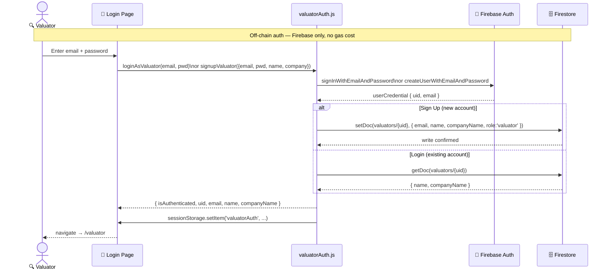
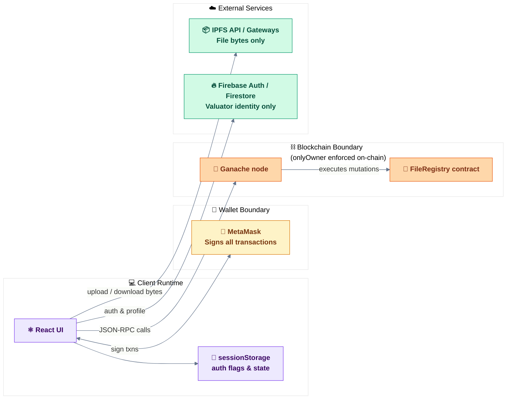
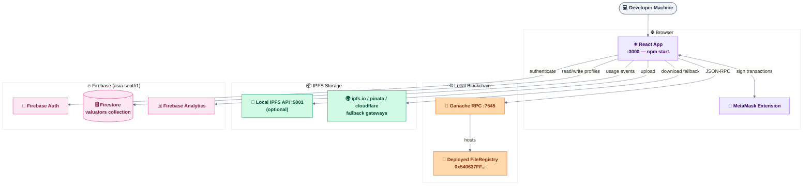

# Chain-Cred Visual Architecture Summary

## 1) System Context

```
┌──────────────────┐                         ┌──────────────────┐
│   General User   │                         │    Valuator      │
└────────┬─────────┘                         └─────────┬────────┘
         │  upload & manage files                      │  view-only access
         └─────────────────────┬───────────────────────┘
                               │
                               ▼
              ┌──────────────────────────────────────┐
              │          React Web App               │
              │           (Frontend)                 │
              └────┬──────────┬──────────┬───────────┘
                   │          │          │          │
         sign txns │   RPC    │  upload  │  auth &  │
                   │  calls   │  /fetch  │  profile │
                   ▼          ▼          ▼          ▼
            ┌──────────┐ ┌─────────┐ ┌────────┐ ┌───────────────┐
            │ MetaMask │ │ Ganache │ │ IPFS   │ │   Firebase    │
            │  Wallet  │ │  :7545  │ │  API   │ │ Auth+Firestore│
            └──────────┘ └────┬────┘ │  /     │ └───────────────┘
                              │      │Gateways│
                              │      └────────┘
                              ▼
                     ┌─────────────────┐
                     │  FileRegistry   │
                     │    Contract     │
                     │   (Solidity)    │
                     └─────────────────┘
```

classDef user fill:#dbeafe,stroke:#2563eb,color:#1e3a8a,font-weight:bold
classDef app fill:#ede9fe,stroke:#7c3aed,color:#3b0764,font-weight:bold
classDef wallet fill:#fef3c7,stroke:#d97706,color:#78350f,font-weight:bold
classDef blockchain fill:#fed7aa,stroke:#ea580c,color:#7c2d12,font-weight:bold
classDef ipfs fill:#d1fae5,stroke:#059669,color:#064e3b,font-weight:bold
classDef firebase fill:#fce7f3,stroke:#db2777,color:#831843,font-weight:bold

User(["👤 General User"]):::user
Valuator(["🔍 Valuator"]):::user
Browser(["⚛️ React Web App"]):::app
MM(["🦊 MetaMask"]):::wallet
Ganache(["⛓️ Ganache\nEthereum Node"]):::blockchain
Contract(["📜 FileRegistry\nSmart Contract"]):::blockchain
IPFS(["📦 IPFS\nAPI / Gateway"]):::ipfs
FirebaseAuth(["🔐 Firebase Auth"]):::firebase
Firestore(["🗄️ Firestore\nvaluators collection"]):::firebase

User -->|upload & manage files| Browser
Valuator -->|view-only access| Browser
Browser <-->|sign transactions| MM
Browser -->|upload & fetch files| IPFS
Browser -->|read & write metadata| Ganache
Ganache -->|executes| Contract
Browser -->|authenticate| FirebaseAuth
Browser -->|store & fetch profile| Firestore
Browser -->|read metadata| Contract

````

## 2) Container Architecture

```mermaid
%%{init: {'theme': 'base', 'themeVariables': {'primaryColor': '#f8fafc', 'lineColor': '#94a3b8'}}}%%
flowchart TB
  classDef page fill:#ede9fe,stroke:#7c3aed,color:#3b0764,font-weight:600
  classDef component fill:#dbeafe,stroke:#2563eb,color:#1e3a8a,font-weight:600
  classDef service fill:#d1fae5,stroke:#059669,color:#064e3b,font-weight:600
  classDef config fill:#f1f5f9,stroke:#64748b,color:#1e293b
  classDef chain fill:#fed7aa,stroke:#ea580c,color:#7c2d12,font-weight:600
  classDef firebase fill:#fce7f3,stroke:#db2777,color:#831843,font-weight:600
  classDef storage fill:#ecfdf5,stroke:#16a34a,color:#14532d,font-weight:600

  subgraph Client["🌐 Client – Browser"]
    App["🧭 App Router"]:::page
    Login["🔑 Login Page"]:::page
    UserDash["📋 User Dashboard"]:::page
    ValDash["🔍 Valuator Dashboard"]:::page
    Skills["📊 Skills Dashboard"]:::page
    Upload["📤 UploadFile"]:::component
    Files["📁 FileList"]:::component
    Download["⬇️ DownloadFile"]:::component
    Delete["🗑️ DeleteFile"]:::component
  end

  subgraph FrontendServices["⚙️ Frontend Services"]
    WalletAuth["🔐 walletAuth.js"]:::service
    ValAuth["🔐 valuatorAuth.js"]:::service
    Web3["🌐 web3.js"]:::service
    ContractSvc["📜 contract.js"]:::service
    IpfsClient["📦 ipfsClient.js"]:::service
    AppConfig["⚙️ appConfig.js"]:::config
    FirebaseCfg["🔥 firebase.js"]:::config
  end

  subgraph Chain["⛓️ Blockchain"]
    GanacheNode["🔷 Ganache :7545"]:::chain
    FileRegistry[("📜 FileRegistry.sol")]:::chain
  end

  subgraph Firebase["🔥 Firebase"]
    Auth["🔐 Firebase Auth"]:::firebase
    DB[("🗄️ Firestore")]:::firebase
  end

  subgraph Storage["📦 File Storage"]
    IPFSApi["🔵 IPFS API :5001"]:::storage
    Gateways["🌍 Public / Local Gateways"]:::storage
  end

  App --> Login & UserDash & ValDash & Skills
  UserDash --> Upload & Files
  ValDash --> Files
  Files --> Download & Delete

  Login --> WalletAuth & ValAuth
  WalletAuth --> Web3 & ContractSvc
  ValAuth --> Auth & DB

  Upload --> IpfsClient & ContractSvc
  Download --> IpfsClient
  Delete --> ContractSvc
  Files --> ContractSvc

  ContractSvc --> GanacheNode --> FileRegistry
  IpfsClient --> IPFSApi & Gateways
````

## 3) Route Map

```mermaid
%%{init: {'theme': 'base', 'themeVariables': {'primaryColor': '#f8fafc', 'lineColor': '#64748b'}}}%%
flowchart LR
  classDef public fill:#fef9c3,stroke:#ca8a04,color:#713f12,font-weight:bold
  classDef protected fill:#dbeafe,stroke:#2563eb,color:#1e3a8a,font-weight:bold
  classDef valuator fill:#fce7f3,stroke:#db2777,color:#831843,font-weight:bold
  classDef catch fill:#f1f5f9,stroke:#94a3b8,color:#475569

  Root(["🏠 /"]):::public --> Login
  Login(["🔑 Login Page"]):::public
  Login -->|"✅ MetaMask success"| User
  Login -->|"✅ Valuator login / signup"| Val
  User(["📋 /dashboard\nUser Dashboard"]):::protected --> Skills
  Skills(["📊 /skills\nSkills Dashboard"]):::protected --> User
  User -->|"🚪 logout"| Login
  Val(["🔍 /valuator\nValuator Dashboard"]):::valuator -->|"🚪 logout"| Login
  Any(["❓ * wildcard"]):::catch -->|"↩ fallback"| Login
```

## 4) Smart Contract Data Model



## 5) Core Sequence Flows

### 5.1 General User Login (Wallet)



### 5.2 Upload Flow



### 5.3 Download Flow



### 5.4 Delete Flow (General User only)



### 5.5 Valuator Auth Flow



## 6) Trust Boundaries and Responsibilities



- Wallet ownership authorization for file mutation is enforced on-chain by `onlyOwner(userId)`.
- Actual file bytes are not on-chain; only metadata (`cid`, `name`, `timestamp`) is stored in contract state.
- Valuator identity and profile are off-chain (Firebase Auth + Firestore).

## 7) Configuration Matrix

| Area               | Source                              | Key Values                                                   |
| ------------------ | ----------------------------------- | ------------------------------------------------------------ |
| Contract + network | `src/config/appConfig.js`           | `contractAddress`, `rpcUrl`, `chainId`                       |
| IPFS behavior      | `src/config/appConfig.js`           | `ipfsGateway`, `ipfsApiUrl`, `useDemoMode`, size/type limits |
| Firebase           | `src/config/firebase.js` + env vars | `REACT_APP_FIREBASE_*`                                       |
| Truffle deployment | `truffle-config.js`                 | `development` host/port/network_id, `solc` version           |
| Firestore security | `firestore.rules`                   | valuator document access constrained to authenticated uid    |

## 8) Deployment View (Development)



## 9) Notes and Constraints

- Smart contract storage is append/remove metadata only; no file versioning or ACL beyond wallet-owner mapping.
- `deleteFile` uses swap-and-pop, so file order can change after deletions.
- IPFS downloads use gateway fallback strategy and timeout handling.
- If running Node 22 with Truffle/Ganache, µWS binary warnings can appear; functionality generally continues with JS fallback.

---

This document reflects the current implementation in the repository and can be used as a handoff reference for onboarding, reviews, and future refactoring.
